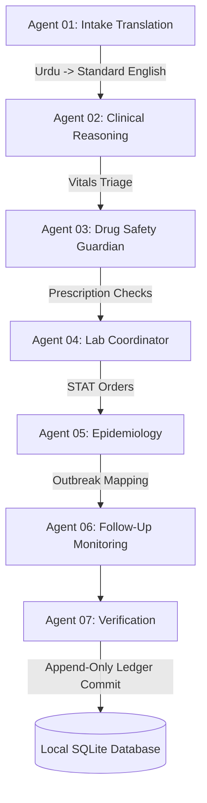

# 🧠 Google Antigravity Orchestrator & Local Databases

Welcome to the intelligence hub of **PANOR (Patient-Augmented Network for Operational Reasoning)**. This directory contains the definitions, prompts, workflows, and offline mock fallbacks for our **Seven Specialized Clinical AI Agents** orchestrated via **Google Antigravity**.

---

## 🤖 The 7-Agent Clinical Workflow

Instead of a generic single-model chatbot, PANOR distributes reasoning tasks to a coordinated network of dedicated agents, guaranteeing absolute safety, drug verification, and clinical precision:

### Modular YAML Declarations
Each agent has a dedicated declarative configuration file located under `antigravity/agents/`:
1.  **`agent_01_intake.yaml`**: Standardizes multilingual voice & text inputs.
2.  **`agent_02_clinical_reasoning.yaml`**: Runs disease differential screening.
3.  **`agent_03_drug_safety.yaml`**: Scans safety blockers and contraindications.
4.  **`agent_04_lab_coordination.yaml`**: Drafts prioritized pathology orders.
5.  **`agent_05_epidemiology.yaml`**: Detects localized disease outbreak hotspots.
6.  **`agent_06_follow_up.yaml`**: Schedules automated recovery check-ins.
7.  **`agent_07_verification.yaml`**: Evaluates confidences and drafts clinical SOAP notes.

---

## 💾 Local SQLite Database Schema & Seeding

For local development, the backend automatically initializes an append-only relational database using **SQLite** (`panor.db`).

### Seeding Script (`seed_db.py`)
To ensure that a hackathon reviewer or evaluator can test the application instantly without needing to manually register multiple users, the database is pre-seeded with highly detailed realistic clinical profiles. 

Executing `python seed_db.py` creates the following accounts:

| User Role | Pre-Seeded Email | Password | Pre-Seeded Medical Identity |
| :--- | :--- | :--- | :--- |
| **Patient** | `patient@panor.com` | `password` | **Rahul Sharma** (Age 45, History of Coronary Artery Disease (CAD), presenting with acute chest pressure). |
| **Doctor** | `doctor@panor.com` | `password` | **Dr. Amit Verma** (Consultant Cardiologist managing a high-volume outpatient panel). |
| **Lab Technician** | `lab@panor.com` | `password` | **Lab Tech** (Pathology workstation officer managing STAT cardiac biomarker queues). |
| **Administrator** | `admin@panor.com` | `password` | **System Administrator** (Monitoring epidemiology outbreak indexes and node status latency logs). |

---

## ⚡ Google Antigravity Local Simulation Fallback Router

In the backend (`backend/app/routes/consultation.py`), the reasoning pipeline connects directly to our **Antigravity Simulation Fallback Engine**. 

If Vertex AI API credentials are not active or configured on the local testing computer, the fallback engine engages automatically, delivering a fully active mock orchestration trace of all 7 agents, draft SOAP notes, and emergency triggers so that the frontend's visual logic can be verified completely offline!
